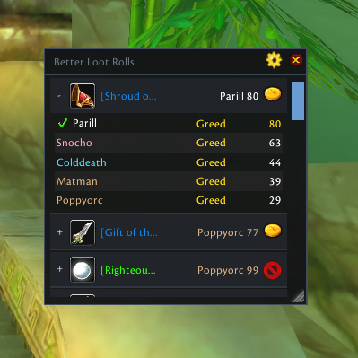

# Better Loot Rolls

Better Loot Rolls is a lightweight group-loot history window for World of
Warcraft Classic Era, Classic Hardcore, and TBC Classic Anniversary. It
presents the same server-provided roll information as Blizzard's `/loot`
window in a movable, fully resizable view.

The included Better Loot Rolls artwork is used in the WoW addon list and in the
addon metadata. The in-game roll window uses a compact header to keep the focus
on loot information.



For each recent item it shows:

- the item icon and link with roll progress or the final result in a collapsed
  summary;
- the player's own Need, Greed, Disenchant, or Pass icon in every item header;
- expandable details for every participating player with class color;
- Need, Greed, Disenchant, Pass, or waiting state;
- each completed roll value;
- a clear winner marker.

The default history contains the last 20 completed items and can be set from 5
to 100. Active rolls are always shown above completed history. Better Loot
Rolls is deliberately not a long-term loot archive and does not collect
statistics.

The addon only observes `C_LootHistory`. It does not alter Blizzard's `/loot`
window and never automates a loot choice.

## Installation

Copy the addon as `BetterLootRolls` into the matching client:

```text
World of Warcraft/_classic_era_/Interface/AddOns/BetterLootRolls/
World of Warcraft/_classic_/Interface/AddOns/BetterLootRolls/
```

After logging in, use `/blr` to toggle the window.
A concise chat message points to `/blr options` on each login.

## Commands

- `/blr` — toggle the roll window;
- `/blr options` — open options;
- `/blr history 20` — keep the chosen number of completed rolls (5–100);
- `/blr clear` — clear completed history;
- `/blr reset` — reset window position, size, and scale;
- `/blr api` — print a compact client/API compatibility report.

The main window can be moved by dragging its subtle title bar and resized from
its bottom-right corner. Its small red X beside the settings gear immediately
clears completed history; active rolls are left intact. The options window can
also be moved by dragging its header. Click an item row to expand or collapse
its roll details; Shift-click still inserts the item link into chat. Position,
size, scale, history limit, and recent rolls are stored account-wide. An
expanded active roll stays open when its winner is announced.

## Current verification status

The source targets Classic Era interface `11509` and TBC interface `20506`,
using the shared `C_LootHistory` API shapes present in Era 1.15.9 and TBC
2.5.6. Offline Lua 5.1 and model tests are included; live-client behavior is
not covered by the automated test suite.

## Support

Source code and issue tracking:

https://github.com/Sukecz/Better-Loot-Rolls

## Development

Run the local checks with:

```bash
bash tests/run.sh
```

### Windows deployment

Keep these two files together on Windows and double-click the `.cmd` launcher:

- `tools/windows/Deploy-WoW-Addons.cmd`
- `tools/windows/Deploy-WoW-Addons.ps1`

This is the shared deployment tool for Better Loot Rolls, Simple Scrolling
Loot, and Simple Arsenal Swap. It uses the existing `ssh minipc` connection,
tests all three projects on MINIPC, stages and validates all three downloads,
and then synchronizes their current runtime files into the Classic Era AddOns
folder. It does not touch WoW SavedVariables. The window closes automatically
after success and stays open on an error so the failure message can be read.
